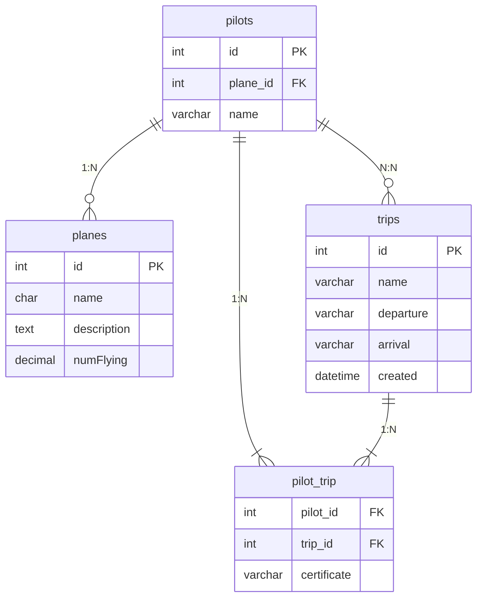

# TP : Refactorisation du modèle de données et manipulation des relations

Dans ce projet vous devez recréez une base de données.

Vous pouvez travailler en équipe de 3 personnes maximum. Renvoyez le projet complet dans un fichier `projet.sql` sur Discord par groupe et individuellement.

L'objectif de ce TP est de refactoriser et enrichir le modèle de données d'une base existante nommée `db_airport`, en introduisant de nouvelles tables et des relations entre elles.

Utilisez le `dump` ci-dessous, pour avoir la structure des tables de notre précédent projet.

[dump.sql](../../Chap5_DQL/dump.sql)

## Prérequis

Avant de commencer, faites une sauvegarde de l'ancienne base de données.

---

## Partie I : Création de la table `planes` et définition des relations

### 1. Création de la table `planes`

Créez la table `planes` avec les colonnes suivantes :
- `id` : clé primaire, `INT UNSIGNED AUTO_INCREMENT`
- `name` : `CHAR(5)`
- `description` : `TEXT`
- `numFlying` : `DECIMAL(8,1)`

**Données à insérer dans la table `planes` :**
```text
+----+------+--------------------------------+-----------+
| id | name | description                    | numFlying |
+----+------+--------------------------------+-----------+
|  1 | A380 | Gros porteur                   |   12000.0 |
|  2 | A320 | Avion de ligne quadriréacteur  |   17000.0 |
|  3 | A340 | Moyen courrier                 |   50000.0 |
+----+------+--------------------------------+-----------+
```

### 2. Ajout d’une clé étrangère dans la table `pilots`

Ajoutez la clé étrangère `plane_id` dans la table `pilots`, qui fera référence à la colonne `id` de la table `planes` :

```sql
ALTER TABLE `pilots`
ADD CONSTRAINT `fk_pilots_planes`
FOREIGN KEY (`plane_id`) REFERENCES `planes`(`id`);
```

### 3. Mises à jour des données

Mettez à jour la table `pilots` pour associer des avions à des pilotes selon les données fournies.

### 4. Suppression de la colonne `plane`

Supprimez la colonne `plane` dans la table `pilots`, car elle est remplacée par la clé étrangère `plane_id`.

### 5. Schéma des relations

Voici un schéma des relations entre les tables `pilots`, `planes`, et `trips` en Mermaid :



---

## Partie II : Contraintes référentielles et manipulation des données

### 6. Contraintes sur la relation `pilots` → `planes`

Le principe des contraintes référentielles est de **maintenir la cohérence de la base de données** :
- Vous ne pouvez pas ajouter ou modifier un enregistrement dans `pilots` avec un `plane_id` inexistant dans `planes`.
- Vous ne pouvez pas supprimer un enregistrement dans `planes` si celui-ci est référencé dans `pilots`.

#### Option : Suppression avec `SET NULL`

Si `plane_id` peut être `NULL`, ajoutez l'option `ON DELETE SET NULL` :

```sql
ALTER TABLE pilots
ADD CONSTRAINT fk_pilots_planes
FOREIGN KEY (`plane_id`) REFERENCES planes(`id`)
ON DELETE SET NULL;
```

Expliquez comment cette option affecte le comportement lors de la suppression d'un avion dans `planes`.

---

## Partie III : Création et liaison de la table `trips`

### 7. Création de la table `trips`

Créez la table `trips` avec les colonnes suivantes. Choisissez les types en fonction de ce qu'ils représentent :
- `id` : clé primaire, `INT UNSIGNED`
- `name` : nom du trajet
- `departure` : ville de départ
- `arrival` : ville d’arrivée
- `created` : date de création

### 8. Relations entre `pilots` et `trips` (N:N)

Décrivez les relations entre les tables `pilots` et `trips` en explicitant leurs cardinalités sous forme de phrases en français.

---

## Partie IV : Implémentation des relations et insertion de données

### 9. Implémentation des relations en SQL

Implémentez le schéma relationnel défini entre `pilots`, `planes`, et `trips` dans MySQL, en tenant compte des contraintes d'unicité sur les relations.

### 10. Insertion d'exemples de données

Ajoutez les enregistrements suivants dans `trips` :

```sql
INSERT INTO `trips`
 (`name`, `departure`, `arrival`, `created`)
VALUES
('direct', 'Paris', 'Brest', '2020-01-01 00:00:00'),
('direct', 'Paris', 'Berlin', '2020-02-01 00:00:00'),
('direct', 'Paris', 'Barcelone', '2020-08-01 00:00:00'),
('direct', 'Amsterdam', 'Brest', '2020-11-11 00:00:00'),
('direct', 'Alger', 'Paris', '2020-09-01 00:00:00'),
('direct', 'Brest', 'Paris', '2020-12-01 00:00:00');
```

Ensuite, ajoutez les enregistrements suivants dans la table de jointure `pilot_trip` :

```sql
INSERT INTO `pilot_trip`
(`certificate`, `trip_id`)
VALUES
('ct-10', 1),
('ct-6', 2),
('ct-100', 1),
('ct-11', 3),
('ct-12', 4),
('ct-10', 4),
('ct-12', 5);
```

---

## Partie V : Requêtes d'interrogation (Facultatif)

### 11. Exercice : Pilotes sans trajet

Écrivez une requête SQL pour sélectionner les pilotes sans trajet associé.

### 12. Exercice : Trajets de chaque pilote

Écrivez une requête SQL pour sélectionner les trajets de chaque pilote.
