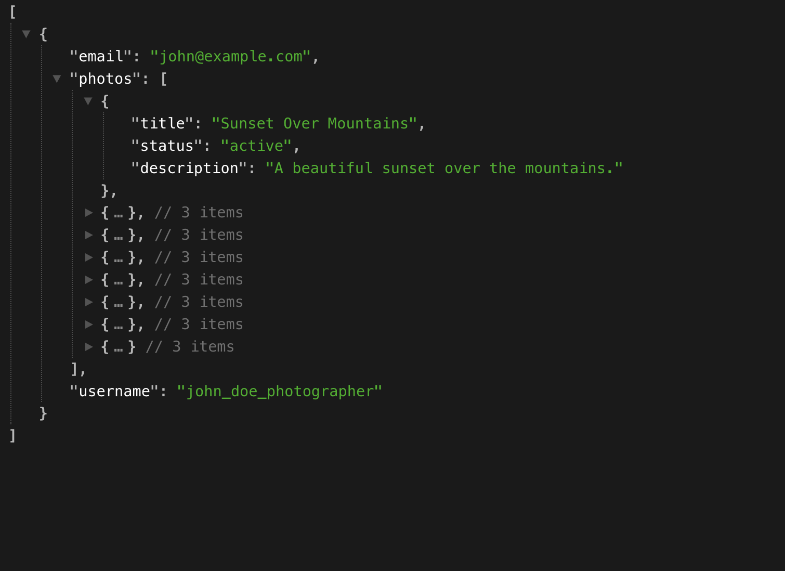

# TP photographe 

Chaque entité ou table doit **possèder** un champ `status` et les champs `created_at`  et  `updated_at`. Le `status` permet de gérer l'état de l'entité et les deux autres les créations et mises à jour des enregistrements.

Vous devez créer les commandes SQL permettant de créer les différentes tables.

Regardez bien les relations, elles sont suffisamments claires pour expliciter les relations entre les entités.

Un jeu de données d'exemple est mis à disposition dans le TP, inspérez vous de ce dernier pour définir les tables du projet.

[jeu de données](#jeu-de-données)

Vous avez également des questions aux quelles vous devez répondre

[questions](./questions_TP_03.md)

### 1. **Tables et leurs attributs :**

- **user**  
  - `id` (PK) : Identifiant unique
  - `username` : Nom d'utilisateur
  - `email` : Email de l'utilisateur
  - `password` : Mot de passe de l'utilisateur
  - `status` : Statut de l'utilisateur (`active`, `inactive`, `deleted`)
  - `created_at` : Date de création du compte
  - `updated_at` : Date de dernière mise à jour du compte

- **category**  
  - `id` (PK) : Identifiant unique
  - `name` : Nom de la catégorie
  - `description` : Description de la catégorie
  - `status` : Statut de la catégorie (`active`, `inactive`, `deleted`)
  - `created_at` : Date de création de la catégorie
  - `updated_at` : Date de dernière mise à jour de la catégorie

- **photo**  
  - `id` (PK) : Identifiant unique
  - `user_id` (FK) : Référence vers `user.id` (indique l'utilisateur qui a ajouté la photo)
  - `title` : Titre de la photo
  - `description` : Description de la photo
  - `url` : URL de la photo
  - `status` : Statut de la photo (`active`, `inactive`, `deleted`)
  - `created_at` : Date de prise ou de téléchargement de la photo
  - `updated_at` : Date de dernière mise à jour de la photo

- **comment**  
  - `id` (PK) : Identifiant unique
  - `photo_id` (FK) : Référence vers `photo.id` (photo sur laquelle le commentaire est posté)
  - `user_id` (FK) : Référence vers `user.id` (utilisateur qui a fait le commentaire)
  - `content` : Contenu du commentaire
  - `status` : Statut du commentaire (`active`, `inactive`, `deleted`)
  - `created_at` : Date de création du commentaire
  - `updated_at` : Date de dernière mise à jour du commentaire

- **photo_category** (table de liaison pour la relation plusieurs-à-plusieurs entre `photo` et `category`)
  - `photo_id` (FK) : Référence vers `photo.id`
  - `category_id` (FK) : Référence vers `category.id`
  - `status` : Statut de la liaison (`active`, `inactive`, `deleted`)
  - `created_at` : Date de création de l’association
  - `updated_at` : Date de dernière mise à jour de l’association

---

### 2. **Relations :**

- **user - ** : Un utilisateur (`user`) peut avoir de 0 à N .
  - Relation : `1:N` entre `user` et `` via `user_id` dans `photo`.

- **photo - category** : Une photo peut être associée à 0 à N catégories, et une catégorie peut contenir 0 à N photo.
  - Relation : `N:M` entre `photo` et `category` via la table de liaison `photo_category`.

- **photo - comment** : Une photo peut avoir de 0 à N commentaires.
  - Relation : `1:N` entre `photo` et `comment` via `photo_id` dans `comment`.

---

### Diagramme Entité-Relation (simplifié en description)

**1.** **user**
   - `(1, N) -> photo`

**2.** **photo**
   - `(1, 1) -> user`
   - `(N, M) -> category` (via `photo_category`)
   - `(1, N) -> comment`

**3.** **category**
   - `(M, N) -> photo` (via `photo_category`)

**4.** **comment**
   - `(N, 1) -> photo`
   - `(N, 1) -> user`

## Partie facultative

Affichez les données à l'aide d'un serveur Node.js



## Jeu de données

```sql

-- Insérer un utilisateur (photographe unique)
INSERT INTO `user` (`username`, `email`, `password`, `status`)
VALUES ('john_doe_photographer', 'john@example.com', 'secure_password_hash', 'active');

-- Insérer des catégories
INSERT INTO `category` (`name`, `description`, `status`)
VALUES 
    ('Landscape', 'Photos of natural landscapes and scenery', 'active'),
    ('Portrait', 'Portrait photography of individuals and groups', 'active'),
    ('Wildlife', 'Captures of animals in their natural habitats', 'active'),
    ('Urban', 'Photos of cityscapes and urban scenes', 'active');

-- Insérer des photos
INSERT INTO `photo` (`user_id`, `title`, `description`, `url`, `status`)
VALUES 
    (1, 'Sunset Over Mountains', 'A beautiful sunset over the mountains.', 'https://example.com/photos/sunset.jpg', 'active'),
    (1, 'City Night Lights', 'A vibrant city at night with stunning lights.', 'https://example.com/photos/city_lights.jpg', 'active'),
    (1, 'Lone Wolf', 'A lone wolf standing in a snowy forest.', 'https://example.com/photos/lone_wolf.jpg', 'active'),
    (1, 'Portrait of an Elder', 'A close-up portrait of an elderly man with expressive features.', 'https://example.com/photos/elder_portrait.jpg', 'active');

-- Associer les photos aux catégories dans la table de liaison `photo_category`
INSERT INTO `photo_category` (`photo_id`, `category_id`, `status`)
VALUES 
    (1, 1, 'active'),  -- Sunset Over Mountains in Landscape
    (2, 4, 'active'),  -- City Night Lights in Urban
    (3, 3, 'active'),  -- Lone Wolf in Wildlife
    (4, 2, 'active');  -- Portrait of an Elder in Portrait

-- Insérer des commentaires sur les photos
INSERT INTO `comment` (`photo_id`, `user_id`, `content`, `status`)
VALUES 
    (1, 1, 'Stunning colors in this sunset!', 'active'),
    (2, 1, 'Amazing cityscape shot!', 'active'),
    (3, 1, 'Love the details on the wolf!', 'active'),
    (4, 1, 'A very emotive portrait.', 'active');
```